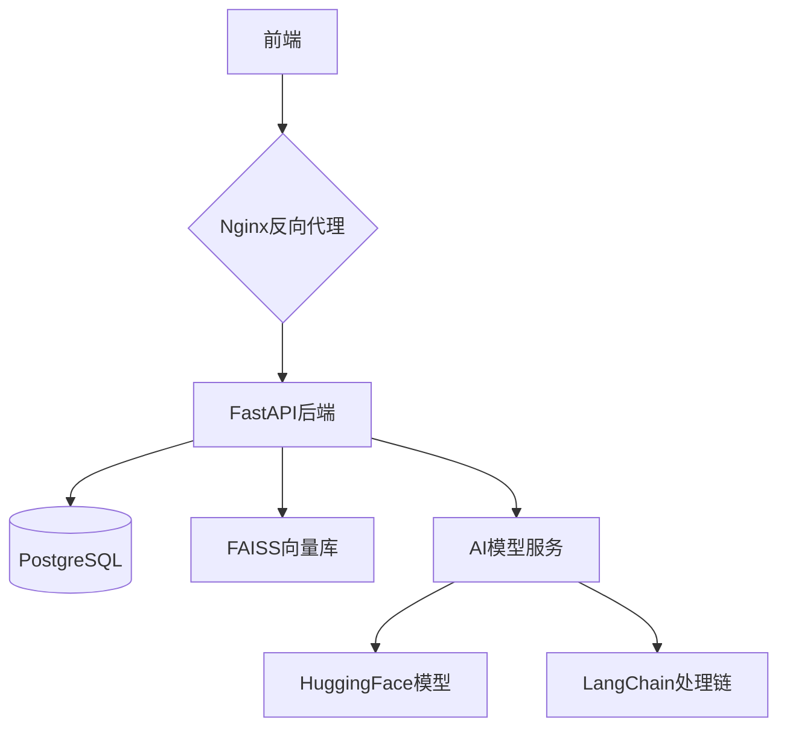
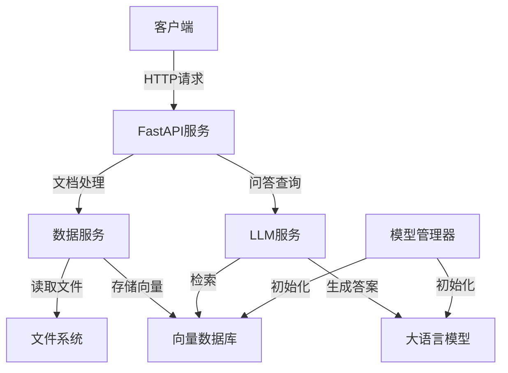

#### **技术选型**

| 模块        | 推荐方案                      | 备注             |
| --------- | ------------------------- | -------------- |
| **前端框架**  | Vue3 + Element            |                |
| **后端框架**  | FastAPI (Python)          |                |
| **向量数据库** | FAISS (本地)                | 上传数据解析后形成向量数据库 |
| **AI模型**  | LangChain + HuggingFace模型 | DeepSeek-r1    |
| **文件解析**  | Unstructured (PDF/TXT解析)  |                |
| **部署工具**  |                           |                |

#### **整体架构设计**

#### server(fastapi后端)
服务端架构设计：

| 描述       | 指令                            |
| -------- | ----------------------------- |
| serve 启动 | python3 scripts/run_server.py |

> [!NOTE] API list
> [knowledge](http://localhost:8000/docs#/knowledge)
> /api/v1/knowledge/   
> /api/v1/knowledge/{knowledge_id}
> /api/v1/knowledge/query
> /api/v1/knowledge/stop
> 
> [data](http://localhost:8000/docs#/data)
> /api/v1/data/process
> 
> [status](http://localhost:8000/docs#/status)
> /api/v1/status/

#### client(前端界面)
